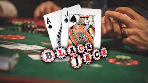

# BLACKJACK 

 

Blackjack is a well-known card game where players compete against a dealer. The player attempts to defeat the Dealer in this game of cards.

---

### Table of Contents

- [Description](#description)
- [Demo](#demo)
- [References](#references)
- [Author Info](#author-info)

---

## Description

Goal - We have to deafect Dealer. The code is well formatted and commented for explaining every case.
 

#### How to play :-

The input for the game will be read from the command line:
Commands accepted from the player:
HIT
STAND
Note: Commands accepted are depicted in bold in the below examples and rest is decided and
printed by the computer. Dealer’s turn should be played by the computer program

X - represents that the card value is hidden from the player. You will see this as part of
Dealer initially when the two cards are dealt each for dealer and player.

In STAND mode press NEXT to contimnue the game

### Technologies

- C++
- STL

---

## Demo
 

   

 

   

 

   

---

## References

- [C++](https://isocpp.org/)
- [BlackJack](https://bicyclecards.com/how-to-play/blackjack/)

---

## Author Info

- LinkedIn - [Dwaraka Poreddy](https://www.linkedin.com/in/dwarakanath-reddy-poreddy-3bbb231b1/)
- Github - [Dwaraka Poreddy](https://github.com/Dwaraka-Poreddy)

